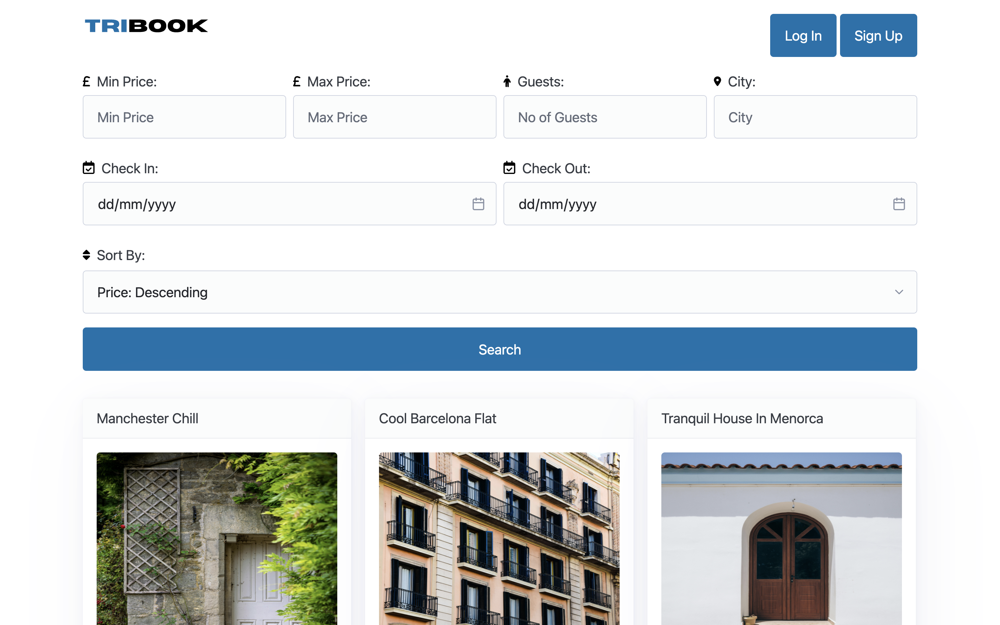
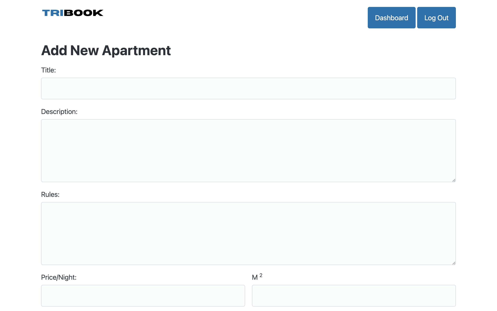
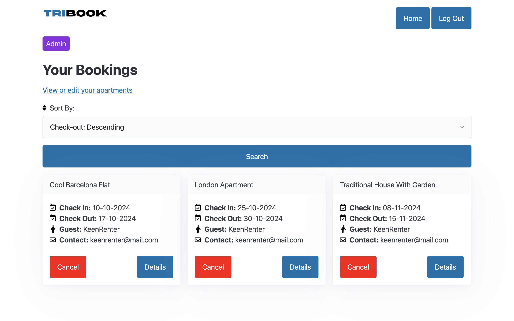

# UF1845: Data Access in Server-Side Web Applications

This fully responsive full-stack apartment rental app, serving as the evaluated project for the UF1845 module, is part of the encompassing IFCD0210 Professional Certificate (Development of Applications with Web Technologies).

Use the app [here](https://uf1845-ironhack.onrender.com/)*       
_<sub>*It may take upto 50 seconds to load due to free hosting limitations</sub>_


## Overview

The UF1845 module focuses on creating dynamic web applications with database access. It covers server-side development, database integration, and security best practices, including server-side validation. The curriculum includes designing, testing, and deploying web applications while managing vulnerabilities and ensuring data consistency and secure operations in production environments.

## Installation

To run the code in this repository, you'll need to have Node.js and npm installed. You can install the required dependencies using npm:

```bash
npm install
```

## Environment Variables
To set up the application, create a .env file in the root directory. In this file, you need to add the following:

- MongoDB Connection String: Include your MongoDB username, password, and database cluster, along with the database name. This connection string is required for the app to perform CRUD (Create, Read, Update, Delete) operations on the database.

- Session Secret: Add a session secret string, which will be used to securely sign and encrypt session data for user authentication.

For reference, check the .env.example file in the root folder for the correct format.

## Usage

After installing the necessary dependencies, you can start the development server by running:

```bash
npm run start
```

This will start the server, and you can navigate to [http://localhost:3000](http://localhost:3000) to view the application in your web browser.

## Project Structure

This repository follows the MVC (Model-View-Controller) architectural pattern and includes the following main directories and files:

- `controllers/`: Contains the logic for handling user input and interacting with the model. Controllers process requests, retrieve data, and return responses.

- `models/`: Defines Mongoose schemas that represent the data structure and business logic of the application. These models interact with the MongoDB database and manage data-related operations.

- `views/`: Includes EJS templates for rendering dynamic HTML content, allowing for the separation of presentation from business logic.

- `public/`: Houses static files, organized into the following folders:

  - `icons/`: Contains icon files used throughout the application.
  - `js/`: Includes JavaScript files for client-side functionality.
  - `css/`: Holds CSS files for styling the application.
  - `logo/`: Contains logo files for branding purposes.
  - `utils/`: Contains utility functions and helpers that provide common functionalities used across the application.

- `app.js/`: The main application file that sets up the Express framework, defines routes for handling HTTP requests, and includes JavaScript for data processing and client-side logic.

- `package.json`: Lists dependencies and scripts required to run the application, facilitating easy management of project dependencies.

## Tools Used

### Development Environment
* Node.js

### Templating Language
* EJS

### Back End
* Express.js
* MongoDB
* Mongoose

### API Testing
* Thunder Client

### Hosting 
* Render (free hosting)

### Others
* cloudinary (image management system)
* leaflet (open-source interactive map)
* flatpickr (datetime picker)

# Features

## Standard users are able to:

### Sign-up Page:
* sign up for either a standard user or admin user account
  
### Log-in Page:
* log in to their account

### Home Page:
* search for apartments using filters such as minimum and maximum price, number of guests, location, latest listings, and available dates



### Apartment Details View:
* view specific details of a selected apartment, including amenities, photos, and other relevant information
* see the exact location of the apartment on an integrated map
* contact the host directly from the apartment view (feature in progress)
* make a booking of the apartment based on check-in and check-out dates


### Dashboard View:
* see all bookings and relevant information such as check-in and check-out dates, price per night and location
* see the actual address of each booking (feature in progress)
* sort bookings based on check-in and check-out dates, and location
* contact the host directly (feature in progress)
* access the apartment details view for each booking


## Admin users are able to:

### Sign-up Page:
* sign up for either an admin user or a standard user account
  
### Log-in Page:
* log in to their account

### Home Page:
* list a new apartment to the database
* search for apartments using filters such as minimum and maximum price, number of guests, location, latest listings, and available dates

### Add/Edit New Apartment View
* add a new apartment including the following details:
  - title
  - description
  - rules
  - price/night
  - square metres
  - maximum number of guests
  - number of bedrooms
  - total beds
  - number of bathrooms
  - a maximum of four photographs
  - amenities:
    - air-conditioning
    - central heating
    - disabled access
    - kitchen
    - TV
    - wifi
  - exact location on an interactive map
  - province
  - city
  - listed/delisted
* edit any of the details of a listed or delisted apartment



### Dashboard Views:
#### View your bookings view:
  * see all bookings and relevant information such as check-in and check-out dates, guest name and guest contact email
  * sort bookings based on check-in and check-out dates, guest name, and apartment name
  * cancel the booking (feature in progress)
  * access the apartment details view for each booking, in which the apartment can be edited
  * access the View or Edit Your Apartments view



#### View or Edit Your Apartments view:
* see all of your apartments on the Tribook appliaction
* sort apartments based on latest and oldest listing, listed or delisted, apartment name, and price 
* see if the apartments are listed or delisted
* edit a specific apartment
* access the View Your Bookings view
  

